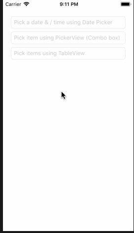

# InputViews

> Input views for UITextField show PickerView, TableView, Collection, instead of default keyboard


It helps you convert ordinary `UITextfield` to item picker of multiple style.

## Features

- [x] Date Picker
- [x] Item Picker using `UIPickerView`
- [x] Item Picker using `UITableView`
- [x] Item Picker using `UICollectionView`
- [x] Quick `AccessoryView` with done button

## Requirements

- iOS 10.0+
- Xcode 10.2.1+

## Installation

#### CocoaPods
You can use [CocoaPods](http://cocoapods.org/) to install `InputViews` by adding it to your `Podfile`:

```ruby
platform :ios, '10.0'
use_frameworks!
pod 'InputViews'
```

To get the full benefits import `InputViews` wherever you import UIKit

``` swift
import UIKit
import InputViews
```

## Examples

| Screenshot1 | Screenshot2 | Screenshot3 | Screenshot4 |
|------------|------------|------------|----------|
|  |  |  |  |

## Usage Guide

### Date Picker (Screenshot1)

```swift
@IBOutlet var datePicker: NoCutPasteTextField? {
  didSet {
    guard let datePicker = datePicker else { return }
    // Setting up input view
    datePicker.inputView = DatePickerInputView.create(
      mode: .dateAndTime, didSelect: { (date) in
        let dateFormatter = DateFormatter()
        dateFormatter.dateFormat = "dd-MMM-yyyy hh:mm a"
        datePicker.text = dateFormatter.string(from: date)
    })
    // Setting up accessory view
    datePicker.inputAccessoryView = AccessoryView.create("Select Date", doneTapped: {
      datePicker.resignFirstResponder()
    })
  }
}
```

### Item picker with `UIPickerView` (Screenshot2)

```swift
@IBOutlet var itemPicker: NoCutPasteTextField? {
  didSet {
    guard let itemPicker = itemPicker else { return }
    // Setting up input view
    let array = ["First item", "Second item", "Third item", "Fourth item", "Fifth", "and sixth"]
    itemPicker.inputView = PickerInputView.create(didSelect: { (index) in
      itemPicker.text = array[index]
    }, items: { () -> [String] in
      return array
    })
    // Setting up accessory view
    itemPicker.inputAccessoryView = AccessoryView.create("Select item", doneTapped: {
      itemPicker.resignFirstResponder()
    })
  }
}
```

### Items picker with `UITableView` (Screenshot3)

```swift
@IBOutlet var itemsFromTablePicker: NoCutPasteTextField? {
  didSet {
    guard let itemsFromTablePicker = itemsFromTablePicker else { return }
    let array = ["First item", "Second item", "Third item", "Fourth item", "Fifth", "and sixth"]
    var selected: [String] = []
    itemsFromTablePicker.inputView = TableInputView.create(items: { () -> [Any] in
      return array
    }, didSelect: { (anyObj) in
      guard let string = anyObj as? String else { return }
      if let index = selected.firstIndex(of: string) { selected.remove(at: index) }
      else { selected.append(string) }
      itemsFromTablePicker.text = selected.joined(separator: ", ")
    }, text: { (anyObject) -> String in
      return anyObject as? String ?? ""
    }, contains: { (anyObj) -> Bool in
      guard let string = anyObj as? String, let _ = selected.firstIndex(of: string)
        else { return false }
      return true
    })
    // Setting up accessory view
    itemsFromTablePicker.inputAccessoryView = AccessoryView.create("Select item", doneTapped: {
      itemsFromTablePicker.resignFirstResponder()
    })
  }
}
```