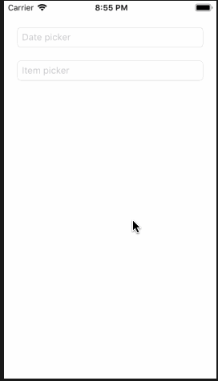
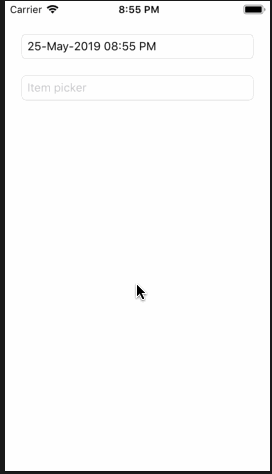
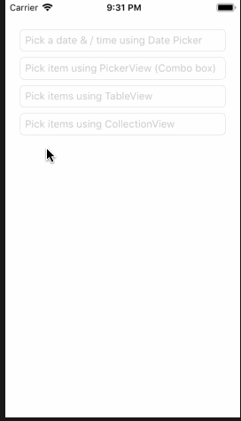

| Example1 | Example2 | Example3 |
|------------|------------|------------|
|  |  |  |
|------------|------------|------------|
| Example4 | -- | -- |
|  | -- | -- |

# InputViews

> Input views for UITextField show PickerView, TableView, Collection, instead of default keyboard


It helps you convert ordinary `UITextfield` to item picker of multiple style.

## Features

- [x] Date Picker
- [x] Item Picker using `UIPickerView`
- [x] Item Picker using `UITableView`
- [x] Item Picker using `UICollectionView`
- [x] Quick `AccessoryView` with done button

## Requirements

- iOS 10.0+
- Xcode 10.2.1+

## Installation

#### CocoaPods
You can use [CocoaPods](http://cocoapods.org/) to install `InputViews` by adding it to your `Podfile`:

```ruby
platform :ios, '10.0'
use_frameworks!
pod 'InputViews'
```

To get the full benefits import `InputViews` wherever you import UIKit

``` swift
import UIKit
import InputViews
```

## Usage Guide

### Date Picker (Example1)

```swift
@IBOutlet var datePicker: NoCutPasteTextField? {
  didSet {
    guard let datePicker = datePicker else { return }
    // Setting up input view
    datePicker.inputView = DatePickerInputView(
      mode: .dateAndTime, didSelect: { (date) in
        let dateFormatter = DateFormatter()
        dateFormatter.dateFormat = "dd-MMM-yyyy hh:mm a"
        datePicker.text = dateFormatter.string(from: date)
    })
    // Setting up accessory view
    datePicker.inputAccessoryView = AccessoryView.create("Select Date", doneTapped: {
      datePicker.resignFirstResponder()
    })
  }
}
```

### Item picker with `UIPickerView` (Example2)

```swift
@IBOutlet var itemPicker: NoCutPasteTextField? {
  didSet {
    guard let itemPicker = itemPicker else { return }
    let array = ["First item", "Second item", "Third item", "Fourth item", "Fifth", "and sixth"]
    // Setting up input view
    let inputView = PickerInputView<String>(height: 250)
    inputView.items = { return array }
    inputView.didSelectAtIndex = { index in itemPicker.text = array[index] }
    inputView.text = { string in return string }
    itemPicker.inputView = inputView
    // Setting up accessory view
    itemPicker.inputAccessoryView = AccessoryView.create("Select item", doneTapped: {
      itemPicker.resignFirstResponder()
    })
  }
}
```

### Items picker with `UITableView` (Example3)

```swift
@IBOutlet var itemsFromTablePicker: NoCutPasteTextField? {
  didSet {
    guard let itemsFromTablePicker = itemsFromTablePicker else { return }
    let array = ["First item", "Second item", "Third item", "Fourth item", "Fifth", "and sixth"]
    var selected: [String] = []
    let inputView = TableInputView<String>.init(height: 250)
    inputView.items = { return array }
    inputView.didSelect = { string in
      if let index = selected.firstIndex(of: string) {
        selected.remove(at: index)
      } else {
        selected.append(string)
      }
      itemsFromTablePicker.text = selected.joined(separator: ", ")
    }
    inputView.contains = { string in return selected.firstIndex(of: string) != nil }
    inputView.text = { string in return string }
    itemsFromTablePicker.inputView = inputView
    // Setting up accessory view
    itemsFromTablePicker.inputAccessoryView = AccessoryView.create("Select item", doneTapped: {
      itemsFromTablePicker.resignFirstResponder()
    })
  }
}
```

### Items picker with `UICollectionView` (Example4)

```swift
@IBOutlet var itemsFromCollectionView: NoCutPasteTextField? {
  didSet {
    guard let itemsFromCollectionView = itemsFromCollectionView else { return }
    let array = ["First item", "Second item", "Third item", "Fourth item", "Fifth", "and sixth"]
    var selected: [String] = []
    let inputView = CollectionInputView<String>(height: 250)
    inputView.items = { return array }
    inputView.didSelect = { string in
      if let index = selected.firstIndex(of: string) {
        selected.remove(at: index)
      } else {
        selected.append(string)
      }
      itemsFromCollectionView.text = selected.joined(separator: ", ")
    }
    inputView.text = { string in return string }
    inputView.contains = { string in return selected.firstIndex(of: string) != nil }
    itemsFromCollectionView.inputView = inputView
    // Setting up accessory view
    itemsFromCollectionView.inputAccessoryView = AccessoryView.create("Select item", doneTapped: {
      itemsFromCollectionView.resignFirstResponder()
    })
  }
}
```